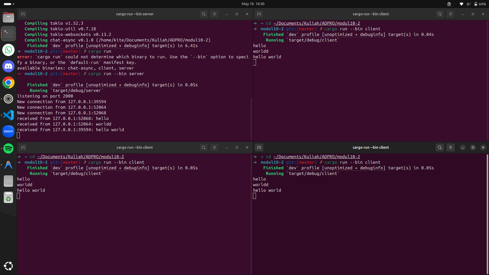

## Cara run
Buka 4 windows terminal dan pindah ke direktori file berada untuk tiap terminal. Untuk server run dengan `cargo run --bin server`. Untuk client run dengan `cargo run --bin client`.

## Penjelasan
Pada eksperimen ini, server websocket berjalan pada alamat `127.0.0.1:2000`. Setiap client terhubung ke server menggunakan protokol websocket. Ketika salah satu client mengirim pesan, server menerima pesan tersebut terlebih dahulu. Setelah itu, server meneruskan atau melakukan broadcast pesan ke client lain yang sedang terhubung. Hal ini menunjukkan bahwa asynchronous programming cocok digunakan pada aplikasi chat karena server harus bisa menangani beberapa client secara bersamaan. Server tidak hanya menunggu satu client saja, tetapi dapat menerima dan meneruskan pesan dari beberapa client secara konkuren.