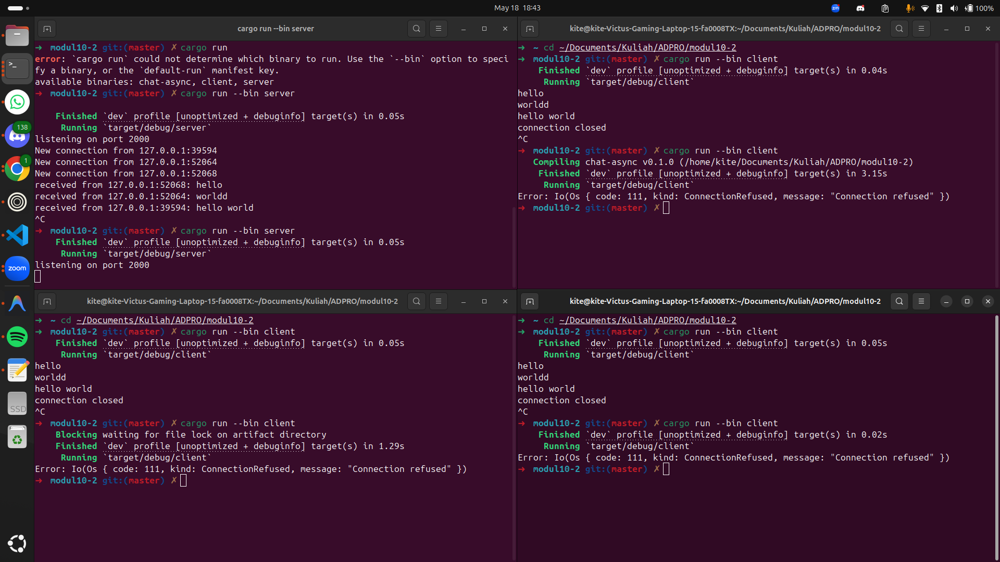
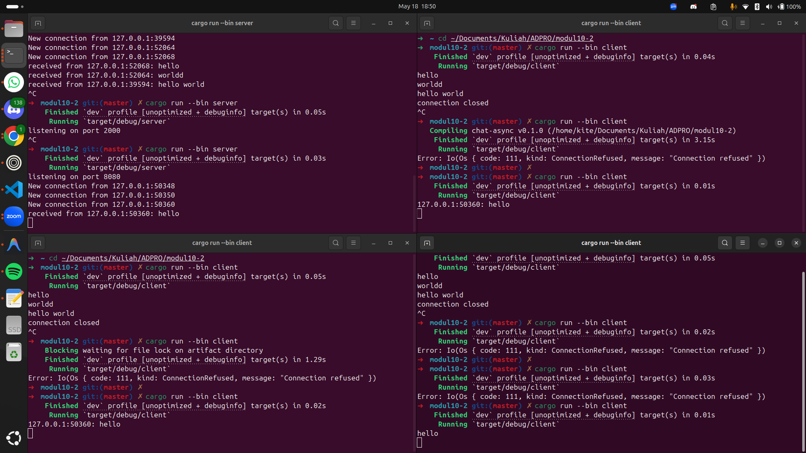

## Cara run
Buka 4 windows terminal dan pindah ke direktori file berada untuk tiap terminal. Untuk server run dengan `cargo run --bin server`. Untuk client run dengan `cargo run --bin client`.

## Penjelasan
Implementasi protokol WebSocket pada alamat 127.0.0.1:2000 memanfaatkan arsitektur event-driven asinkron untuk mentransformasikan pesan dari satu client menjadi siaran masif (broadcast) ke seluruh pengguna terhubung secara instan tanpa hambatan. Struktur pemrograman asinkron ini menjadi fondasi paling ideal bagi sistem obrolan (chat application) karena mengeliminasi pemborosan memori akibat pembuatan thread baru untuk setiap koneksi; alih-alih memaksa CPU macet dalam posisi memblokir (blocking) demi menunggu respons sekuensial dari satu soket, eksekutor jaringan dapat terus menerima dan mendistribusikan aliran data dari banyak pintu gerbang komunikasi secara simultan dan konkuren. Mekanisme ini bekerja persis seperti infrastruktur menara pemancar radio pusat dan jaringan walkie-talkie, di mana setiap transmisi suara tidak diantrekan secara lambat layaknya kurir mengirimkan paket satu per satu, melainkan langsung dilempar ke satu spektrum frekuensi udara yang sama sehingga seluruh perangkat yang aktif mampu menangkap informasi tersebut pada detik yang sama tanpa ada waktu tunggu.

## Penjelasan
Modifikasi port jaringan dari 2000 menjadi 8080 menuntut sinkronisasi absolut antara arsitektur pelayan (server) dan pengguna (client) karena jabat tangan (handshake) protokol WebSocket mewajibkan keselarasan titik akhir (endpoint) secara mutlak agar soket komunikasi dapat dibangun. Di tingkat akar, konfigurasi sisi server wajib dirombak pada fungsi pengikatan jaringan menjadi TcpListener::bind("127.0.0.1:8080"), sementara sisi client harus disesuaikan secara pararel pada fungsi alokasi alamat menjadi Uri::from_static("ws://127.0.0.1:8080"). Kelalaian dalam menyelaraskan perubahan ini—di mana port hanya diganti pada salah satu berkas—akan langsung memicu galat kegagalan koneksi (connection refused) akibat paket data jabat tangan dikirimkan ke gerbang pintu port yang salah, namun ketika kedua sisi telah dikonfigurasi secara konsisten, seluruh aliran data aplikasi obrolan terbukti tetap mampu beroperasi secara normal tanpa kendala.

## Penjelasan
Server kini menandai (prefix) setiap pesan broadcast dengan alamat soket pengirim (IP:Port). Karena saat ini belum ada nama pengguna, perubahan ini membuat penerima dapat melihat dari mana pesan berasal. Perubahan dilakukan pada `src/bin/server.rs` — sebelum mengirim ke klien lain, server membentuk pesan seperti:

- Contoh keluaran klien:

	127.0.0.1:54321: Halo semuanya

- Alasan perubahan: memberi konteks pengirim (identifikasi minimal) tanpa menambahkan mekanisme otentikasi atau input nama pengguna.

Perubahan teknis singkat: pada saat broadcast, server mengubah baris pengiriman menjadi:

`let tagged = format!("{}: {}", sender_addr, text);`
`ws_stream.send(Message::text(tagged)).await?;`

